# OS - ORANGE PROBLEM REPORT

# Building PES-VCS — A Version Control System from Scratch

**NAME:** ANANYA BELIMALLUR RAJASHEKAR  
**SRN:** PES2UG24CS057  

---

## Phase 1: Object Storage Foundation

### Screenshot 1A: Output of ./test_objects showing all tests passing.

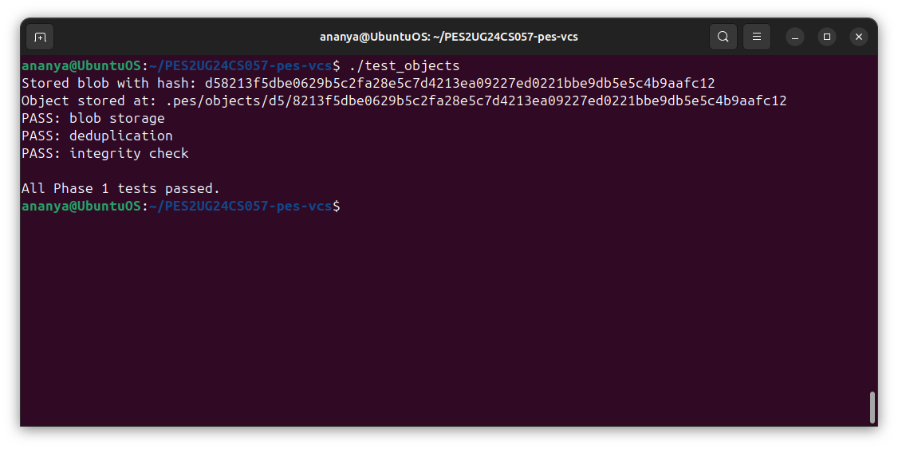

### Screenshot 1B: find .pes/objects -type f showing the sharded directory structure.

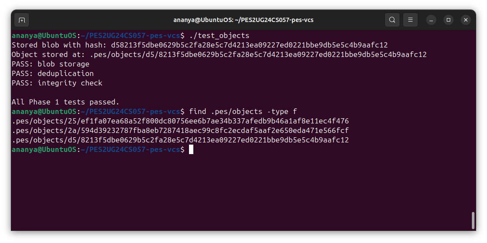

### Summary
Object storage implementation complete. The `object_write` and `object_read` functions successfully:
- Store objects with type headers (blob, tree, commit)
- Compute SHA-256 hashes for content addressing
- Shard objects into subdirectories by first 2 hex characters
- Verify integrity on retrieval

---

## Phase 2: Tree Objects

### Screenshot 2A: Output of ./test_tree showing all tests passing.

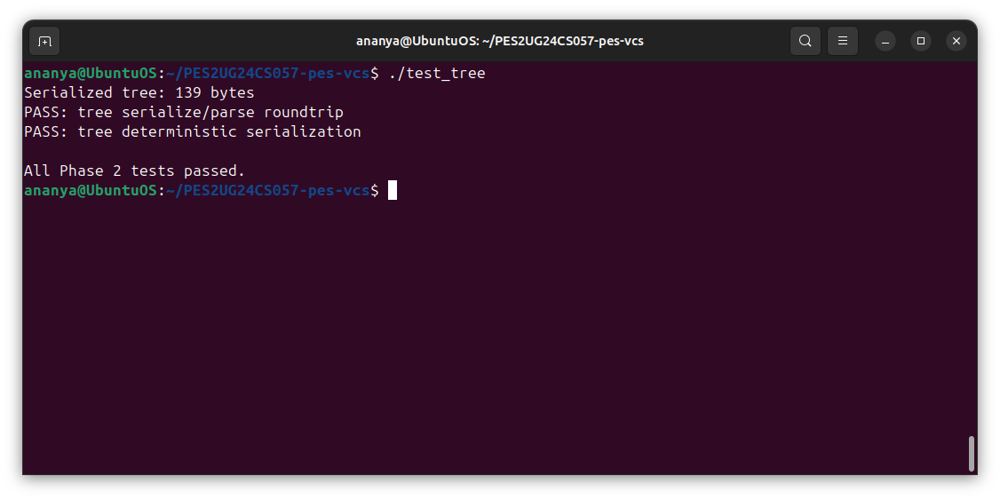

### Screenshot 2B: Pick a tree object from find .pes/objects -type f and run xxd .pes/objects/XX/YYY... | head -20 to show the raw binary format.

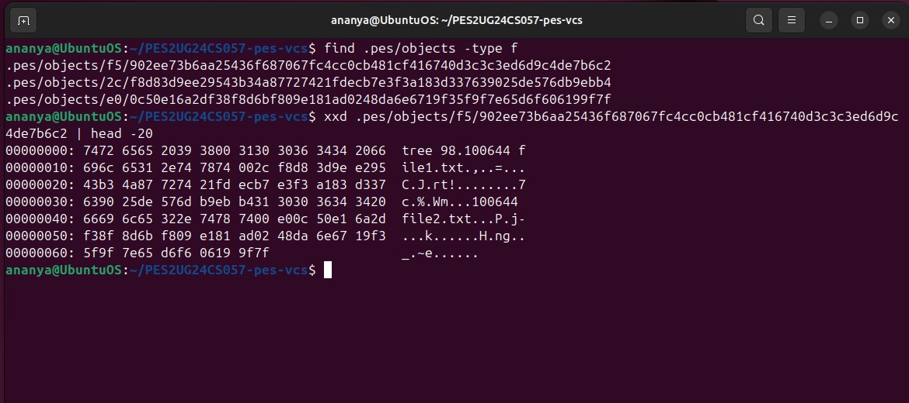

### Summary
Tree object implementation complete. The `tree_from_index` function:
- Builds hierarchical tree structures from index entries
- Handles nested paths and creates intermediate directories
- Writes all tree objects to the object store
- Returns root tree hash for commits

---

## Phase 3: The Index (Staging Area)

### Screenshot 3A: Run ./pes init, ./pes add file1.txt file2.txt, ./pes status — show the output.

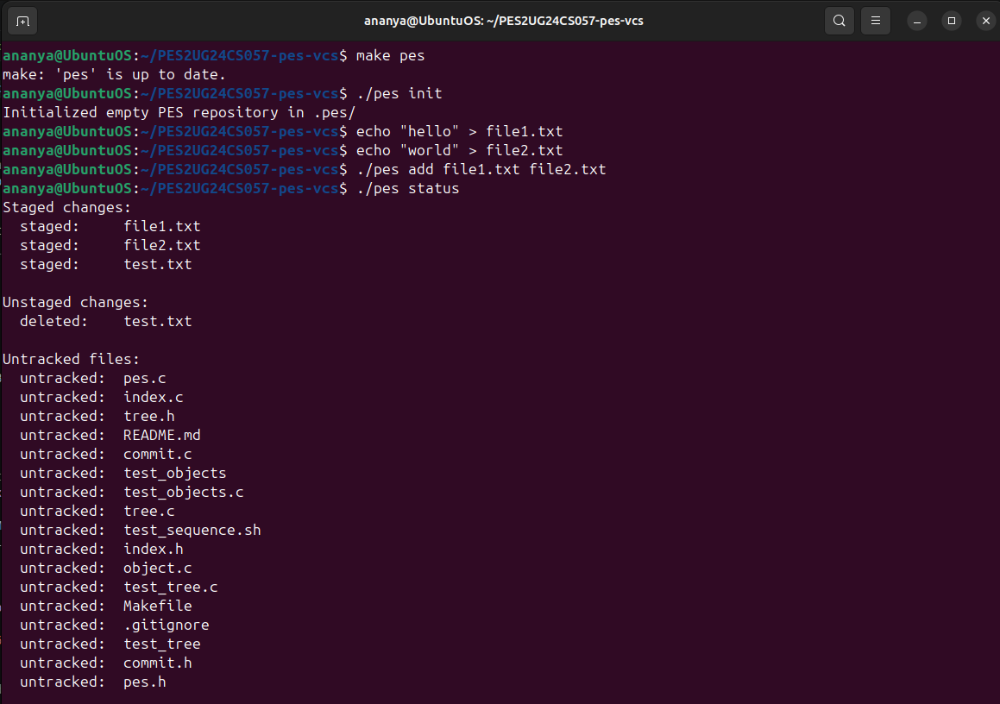

### Screenshot 3B: cat .pes/index showing the text-format index with your entries.

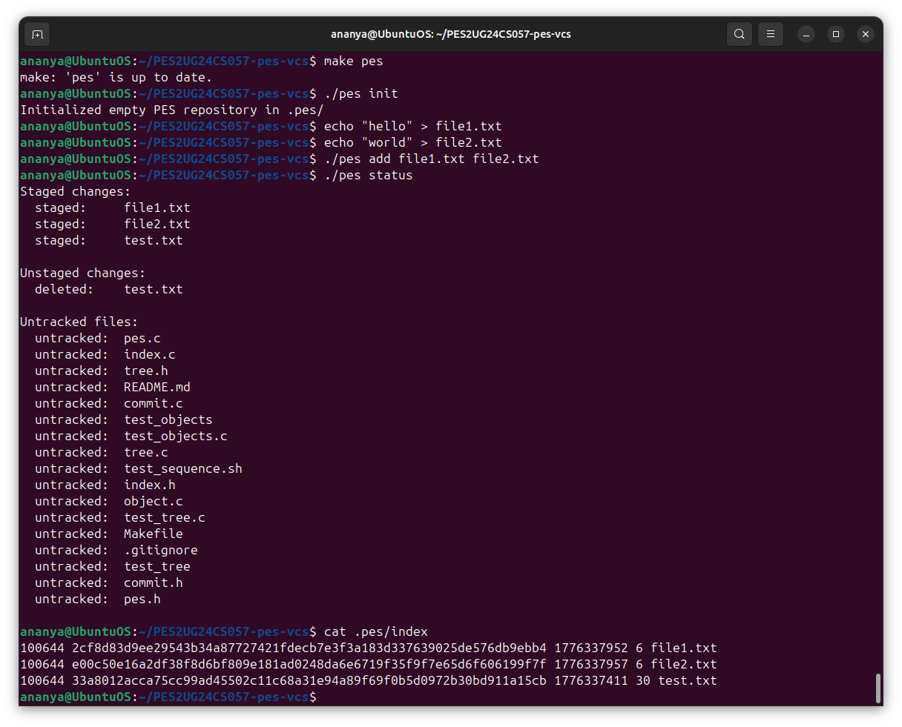

### Summary
Index implementation complete. Functions implemented:
- `index_load`: Reads text-based index file, handles missing file gracefully
- `index_save`: Atomically writes index entries sorted by path
- `index_add`: Stages files by computing blob hash and updating index entry

---

## Phase 4: Commits and History

### Screenshot 4A: Output of ./pes log showing three commits with hashes, authors, timestamps, and messages.

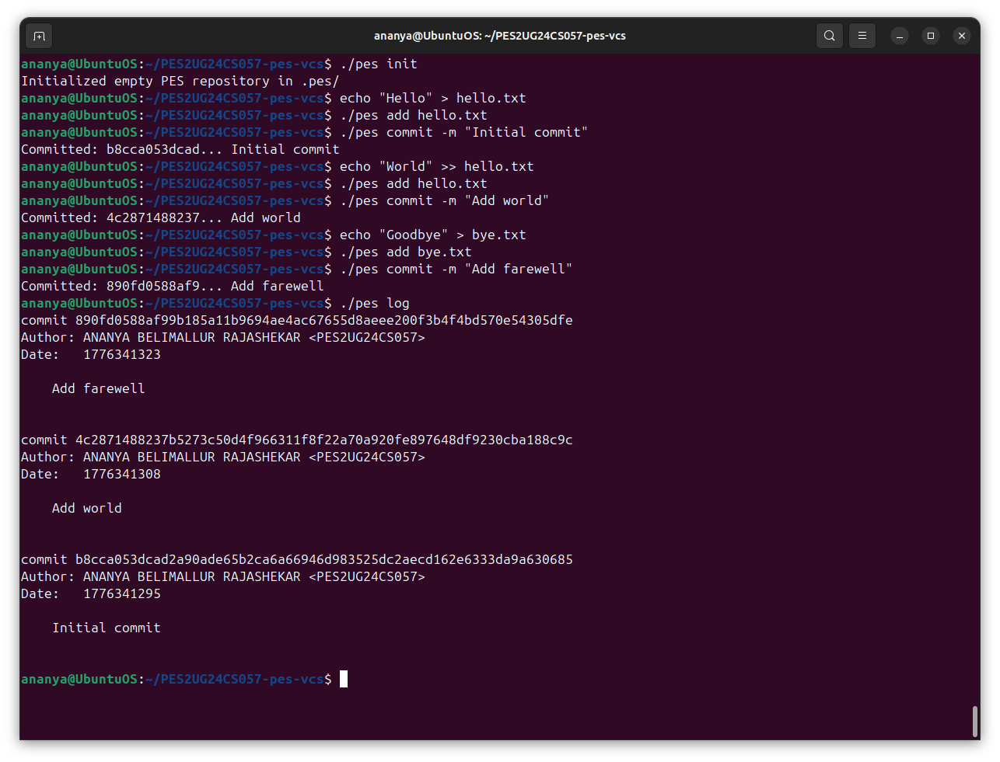

### Screenshot 4B: find .pes -type f | sort showing object store growth after three commits.

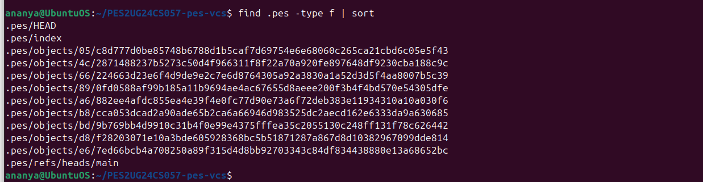

### Screenshot 4C: cat .pes/refs/heads/main and cat .pes/HEAD showing the reference chain.

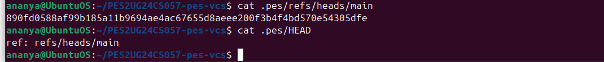

### Summary
Commit implementation complete. The `commit_create` function:
- Builds tree from staged changes
- Reads parent commit from HEAD
- Writes commit object with metadata (author, timestamp, message)
- Updates branch reference to new commit

---

## FULL INTEGRATION TEST:

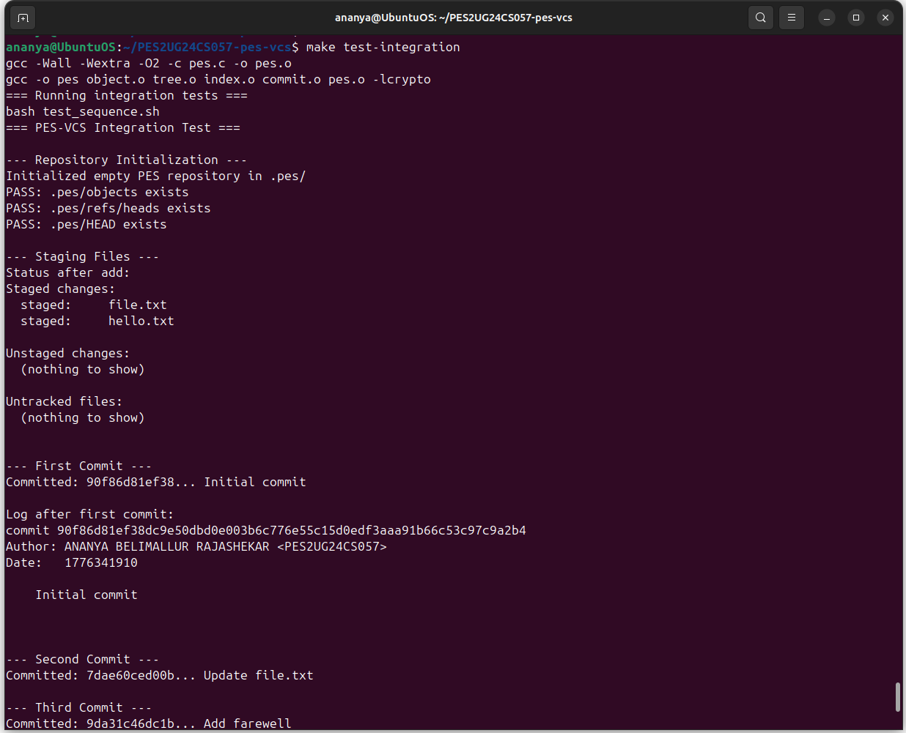

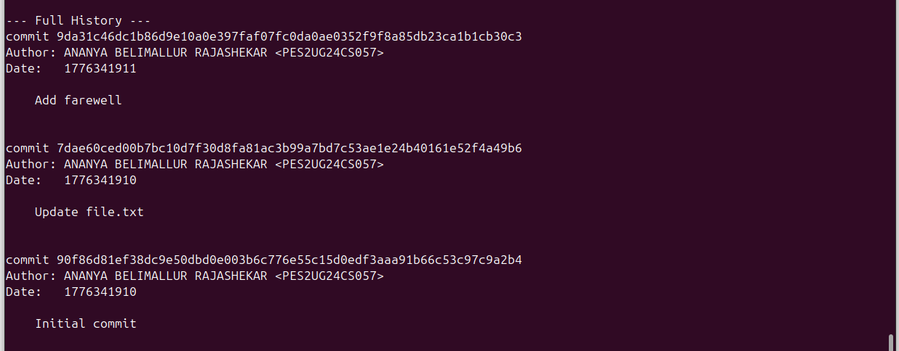

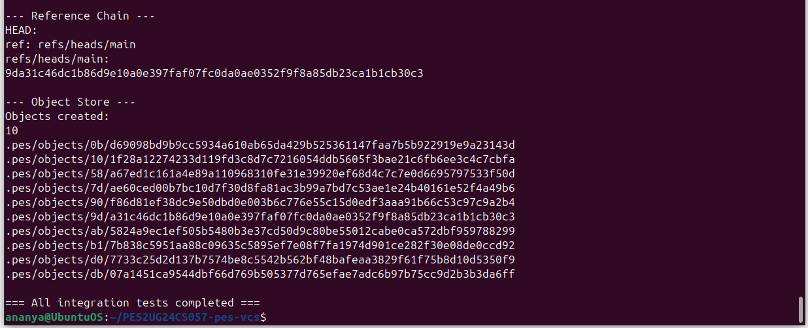

---

## Phase 5 & 6: Analysis-Only Questions

### Branching and Checkout

#### Q5.1: A branch in Git is just a file in .git/refs/heads/ containing a commit hash. Creating a branch is creating a file. Given this, how would you implement pes checkout <branch> — what files need to change in .pes/, and what must happen to the working directory? What makes this operation complex?

**ANSWER:**

**Files that need to change in .pes/:**
Only one file needs to change for the reference side: .pes/HEAD. It must be updated to point to the new branch, i.e., its content changes from ref: refs/heads/old-branch to ref: refs/heads/new-branch. The branch file itself (.pes/refs/heads/<branch>) is not created by checkout — it must already exist.

**What must happen to the working directory:**
- Read the current HEAD commit → parse its tree object to get the current snapshot.
- Read the target branch's commit → parse its tree object to get the target snapshot.
- Walk both trees recursively and compute three sets: files only in the current tree (to be deleted), files only in the target tree (to be created/written), and files present in both but with different blob hashes (to be overwritten).
- Apply those changes to the working directory on disk.
- Replace the index entirely with the entries from the target branch's tree (since the index should reflect what is committed on the new branch).

**What makes it complex:**
The main source of complexity is safely handling the working directory while preserving user data. Specifically:
- **Dirty file detection:** If a tracked file has been modified since the last pes add (i.e., its current on-disk content differs from what's in the index), and that same file differs between the two branches, checkout cannot safely overwrite it without losing the user's work. The operation must be aborted.
- **Recursive tree diffing:** Trees can be nested (src/util/helper.c), so the diff must be fully recursive.
- **Atomicity:** If checkout fails halfway through (e.g., a file can't be written due to permissions), the repository is in a half-updated state. Real Git addresses this by checking for conflicts before touching the working directory.
- **Untracked files:** If the target branch would write a file that currently exists as an untracked file in the working directory, checkout must warn or refuse to avoid silently destroying data.

---

#### Q5.2: When switching branches, the working directory must be updated to match the target branch's tree. If the user has uncommitted changes to a tracked file, and that file differs between branches, checkout must refuse. Describe how you would detect this "dirty working directory" conflict using only the index and the object store.

**ANSWER:**

The goal is to determine whether the current working directory has unsaved changes to any file that would be overwritten by a checkout.

Using only the index and the object store, the algorithm is:
- For each file that differs between the two branches' trees (computed by comparing blob hashes at each path), check whether the user has local modifications to that file.
- To check for local modifications, look up the file's entry in .pes/index. The index stores the mtime (last modified time) and size of the file at the time it was last staged.
- **Fast path:** Call stat() on the working directory file. If the current mtime and size match the index entry exactly, the file has not changed — no conflict.
- **Slow path** (if mtime or size differs): Read the file's current contents from disk, compute its SHA-256 hash, and compare it to the blob hash stored in the index. If they differ, the file has been modified and the checkout must refuse for this file.
- Additionally, if a file exists in the index (meaning it was previously staged/committed) but is missing from the working directory, that counts as a "deleted" local modification and must also be flagged.

This approach requires no extra metadata beyond what the index already stores — the mtime/size pair serves as a fast fingerprint, with content hashing as the authoritative fallback.

---

#### Q5.3: "Detached HEAD" means HEAD contains a commit hash directly instead of a branch reference. What happens if you make commits in this state? How could a user recover those commits?

**ANSWER:**

**What happens when you commit in detached HEAD state:**
When HEAD contains a raw commit hash (e.g., a1b2c3d4...) rather than a branch reference like ref: refs/heads/main, there is no branch pointer to update. Each pes commit still creates a valid commit object in the object store and updates HEAD to point to the new commit's hash. So the commits do get created and stored correctly. However, since no branch file points to them, they are not reachable from any branch. They exist as orphaned objects — valid, but invisible to pes log (which walks from the current branch tip).

The danger: If you switch to another branch or commit while in detached HEAD, HEAD gets overwritten. The orphaned commits are now unreachable by any reference, making them candidates for garbage collection. Their hashes are not stored anywhere persistent.

**How a user could recover those commits:**
- If the user still has the terminal open, they can see the commit hash that was printed when they ran pes commit. They can create a new branch pointing to that hash: by writing the hash into .pes/refs/heads/recovery-branch and updating HEAD to point to that branch.
- If the hash is not visible in the terminal, the user would need to scan all objects in .pes/objects/ manually, read each one, check if it is a commit type, and trace its parent chain to find the orphaned commits. This is essentially what Git's git reflog does automatically — it keeps a log of every value HEAD has ever held, so detached-HEAD commits can always be found. PES-VCS does not implement a reflog, so recovery without the hash is difficult.

---

### Garbage Collection and Space Reclamation

#### Q6.1: Over time, the object store accumulates unreachable objects — blobs, trees, or commits that no branch points to (directly or transitively). Describe an algorithm to find and delete these objects. What data structure would you use to track "reachable" hashes efficiently? For a repository with 100,000 commits and 50 branches, estimate how many objects you'd need to visit.

**ANSWER:**

**Algorithm (Mark and Sweep):**
The classic approach is a two-phase mark-and-sweep:

*Mark phase — find all reachable objects:*
1. Start with the set of all branch tips: read every file under .pes/refs/heads/ to get a set of commit hashes.
2. For each starting commit hash, perform a traversal:
   - Read the commit object → mark its hash as reachable.
   - Add its tree hash to a queue.
   - If it has a parent hash, add that to the queue too.
3. For each tree hash in the queue:
   - Read the tree object → mark its hash as reachable.
   - For each entry: if it is a blob, mark the blob hash as reachable. If it is a subtree, add it to the queue.
4. Continue until the queue is empty. Every hash in the "reachable" set is live.

*Sweep phase — delete unreachable objects:*
1. Enumerate all files under .pes/objects/ (reconstruct each hash from its directory + filename).
2. For each hash, if it is not in the reachable set, delete the file.

**Data structure:** A hash set (e.g., a C uthash table, or in higher-level languages, a HashSet<string>) is ideal for tracking reachable hashes. Lookup and insertion are O(1) average, which matters when you have hundreds of thousands of objects.

**Estimation for 100,000 commits and 50 branches:**
- Starting points: 50 branch tips → 50 commit hashes.
- Each commit points to 1 tree. Assuming an average project with ~20 files across ~5 directories, each commit visits roughly 6 tree objects and 20 blob objects = ~26 objects per commit.
- Traversing 100,000 commits: approximately 100,000 × (1 commit + 6 trees + 20 blobs) ≈ 2,700,000 object visits in the worst case. In practice, many blobs and trees are shared across commits (unchanged files), so the actual number of unique objects is far lower — Git repositories are typically very efficient due to this sharing. A realistic estimate for a mature repo might be 300,000–500,000 unique reachable objects visited.

---

#### Q6.2: Why is it dangerous to run garbage collection concurrently with a commit operation? Describe a race condition where GC could delete an object that a concurrent commit is about to reference. How does Git's real GC avoid this?

**ANSWER:**

**The race condition:**
Consider this interleaving between a GC process and a concurrent pes commit:
1. GC begins its mark phase. It scans all branch tips and builds its reachable set. At this moment, the in-progress commit's new blob and tree objects don't exist yet, so they are not reachable from any reference.
2. Commit runs pes add → writes a new blob object to .pes/objects/. The blob exists on disk but is not yet referenced by any commit or index entry visible to GC.
3. GC moves to its sweep phase. It enumerates all objects. It finds the new blob — it is not in the reachable set (GC's mark phase finished before the blob existed as a reachable commit). GC deletes the blob.
4. Commit proceeds to call commit_create, which builds a tree pointing to that blob hash and writes a commit object. The commit and tree are written, HEAD is updated — but the blob they reference has been deleted. The repository is now corrupt: the commit points to an object that no longer exists.

**How Git avoids this:**
Git uses a grace period / recency heuristic: during GC, it never deletes any object that was created within the last 2 weeks (configurable via gc.pruneExpire, default 2.weeks.ago). Since a commit operation takes milliseconds, any object written during an in-progress commit will be far younger than the grace period and will not be swept. Only truly old, long-unreachable objects are deleted.

Additionally, Git writes objects to the object store before updating any references. This means the window where a valid, soon-to-be-referenced object is technically "unreachable" is extremely short. The grace period is a belt-and-suspenders safety net that covers even slow operations or crashed processes that left partially-written objects behind.

---

